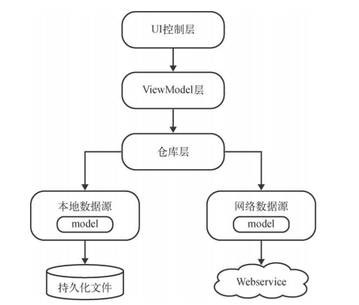
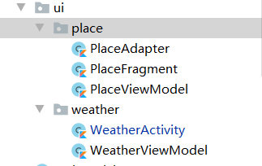

# MVVC



自低向上开发

## 本地数据&网络数据

### Model

- Model包中为Data类，当读取到JSON文件时，通过`Gson`框架进行处理使数据以Model包中的Data类的格式存在内存中

- JSON与Data类对应的例子：

  ```json
  {
      "status":"ok",
      "query":"北京",
      "places":[
          {
              "name":"北京市",
              "location":{"lat":39.9041999,"lng":116.4073963},
              "formatted_address":"中国北京市"
          }
      ]
  }
  ```

  

  ```kotlin
  data class PlaceResponse(val status: String, val places: List<Place>) {
  
      // 城市
      data class Place(
          val name: String,
          // 经纬度
          val location: Location,
          @SerializedName("formatted_address") val address: String
      )
  
      data class Location(val lng: String, val lat: String)
  }
  ```

  

### Data Access Object

- 在**Dao包**中编写相关代码
- 此包中编写本地存储相关的代码，采用`sharedPreferences`进行编写
- 读取数据统一转换为JSON格式，并采用`Gson`框架进行处理

- 例：

  ```kotlin
  // 存取本地place对象的Dao
  object PlaceDao {
      // 存
      fun savePlace(place: PlaceResponse.Place){
          sharedPreferences().edit {
              // 以Json存
              putString("name",Gson().toJson(place))
          }
      }
      // 取
      fun getSavedPlace(): PlaceResponse.Place {
          val placeJson = sharedPreferences().getString(...)
          // 将Json数据转换为data数据类型
          return Gson().fromJson(placeJson,PlaceDataObject)
      }
      private fun sharedPreferences() = Globalcontext.getSharedPreferences("name",Context.MODE_PRIVATE)
  }
  ```

### WebService

- 在**network包**中编写网络相关代码
- 采用`retrofit2`框架进行编写

#### ServiceCreator

- `retrofit2`每次创建Service都需要编写重复代码

- 编写一个`ServiceCreator`类来解决此问题

  ```kotlin
  object ServiceCreator {
      // 有了服务器的BASE_URL，编写Service时就可以使用相对路径
      private const val BASE_URL = ""
  
      private val retrofit = Retrofit.Builder()
          .baseUrl(BASE_URL)
          .addConverterFactory(GsonConverterFactory.create())
          .build()
      // create出动态代理对象
      fun <T> create(serviceClass: Class<T>): T = retrofit.create(serviceClass)
      inline fun <reified T> create(): T = create(T::class.java)
  }
  ```

#### Service

- `XXXService`对象为`retrofit2`中的网络接口对象，提供向服务器请求数据的接口功能

- 返回的数据会被包装为`Call<model>`对象

- 例：

  ```kotlin
  interface PlaceService {
      @GET("v2/place?token=${SunnyWeatherApplication.TOKEN}&lang=zh_CN")
      fun searchPlaces(@Query("query") query: String): Call<PlaceResponse>
  }
  ```

#### Network

- `XXXNetwork`对象是**网络数据源向仓库层提供的向上接口**
- 此类中通过`ServiecCreator`获得每一个service接口对象，并对每一个接口**采用协程**进行一次封装
  - 对每一个Service的网络请求返回的`Call`对象进行`enqueue()`调用，`Retrofit`会根据注解中配置的服务器接口地址去进行网络请求，并将数据回调到`enqueue`方法中传入的`Callback`内
    - 当请求发起时，会自动开启子线程
    - 当回调到`Callback`中，会返回主线程
  - 不同的网络请求可能会实现不同的`enqueue()`逻辑，对于重复的逻辑，可以封装为一个`helper`协程进行处理，减少重复的代码

- 例：

  ```kotlin
  object SunnyWeatherNetwork {
      private val placeService = ServiceCreator.create<PlaceService>()
      suspend fun searchPlaces(query: String) = placeService.searchPlaces(query).await()
      
      // 封装enqueue()的协程
      private suspend fun <T> Call<T>.await(): T {
          return suspendCoroutine { continuation ->
              enqueue(object : Callback<T> {
                  override fun onResponse(call: Call<T>, response: Response<T>) {
                      // 在onResponse方法中调用body()来获得T类型的数据
                      val body = response.body()
                      if (body != null)
                          continuation.resume(body)
                      else
                          continuation.resumeWithException(
                              RuntimeException("response body is null")
                          )
                  }
  
                  override fun onFailure(call: Call<T>, t: Throwable) {
                      continuation.resumeWithException(t)
                  }
  
              })
          }
      }
  }
  ```

## 仓库层

- 这一层非常重要，起到上下连接作用

- **使用`LiveData`来进行上下层的连接**

- 使用`lifecycle-livedata-ktx`库提供的`liveData<T>()`函数来自动构建并返回一个`LiveData`对象

  - 在liveData()函数的最后的lambda表达式中进行Network或Dao中相应接口的调用

- 由于liveData()函数中的lambda表达式需要调用网络请求接口会抛出异常，所以每次都要进行try catch处理，因此可以封装进一个接口避免重复的try catch处理

- 例

  ```kotlin
  object Repository {
      // 线程参数传入Dispatchers.IO，使所有操作在子线程中操作
      fun searchPlaces(query: String) = fire(Dispatchers.IO) {
          val placeResponse = SunnyWeatherNetwork.searchPlaces(query)
          if (placeResponse.status == "ok") {
              val places = placeResponse.places
              // 返回Result
              Result.success(places)
          } else {
              Result.failure(RuntimeException("response status is ${placeResponse.status}"))
          }
      }
      
  	private fun <T> fire(context: CoroutineContext, block: suspend () -> Result<T>) =
          liveData<Result<T>>(context) {
              val result = try {
                  block()
              } catch (e: Exception) {
                  Result.failure<T>(e)
              }
              emit(result)
          }
  }
  ```

  

## UI



- 对于每一板块的UI，单独分包，每个版块都应该包含Fragment/Activity和对应的ViewModel

### ViewModel

- 对于每个Activity或Fragment，都应有对于的ViewModel来管理与UI相关的数据

- ViewModel使用`LiveData`来管理与仓库层相关的数据

- 对于与UI有关的缓存数据，直接采用成员变量的方式

- 例

  ```kotlin
  class PlaceViewModel : ViewModel() {
      // 存query
      private val searchLiveData = MutableLiveData<String>()
  
      // 缓存城市数据（与UI有关）
      val placeList = ArrayList<PlaceResponse.Place>()
  
      // 使用switchMap来观察仓库层的LiveData对象
      // activity应监视此对象
      val placeLiveData = Transformations.switchMap(searchLiveData) { query ->
          Repository.searchPlaces(query)
      }
  
      // activity中调用此函数会修改searchLiveData的值并回调switchMap并返回一个相应的LiveData对象给activity监视
      fun searchPlaces(query: String) {
          searchLiveData.value = query
      }
  }
  ```

  

### Activity/Fragment

- 在这里编写UI的控制层代码
- 对于每个ViewModel的liveData，创建observe进行监视

